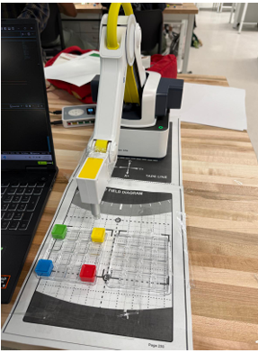
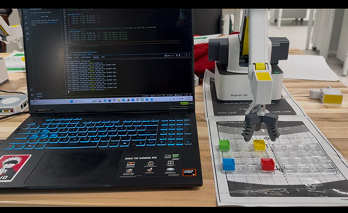

# Suction and Gripper End Effectors for Pallet Handling

**Name:** Harish Anand  
**Institution:** Ira A. Fulton Schools of Engineering, Arizona State University, Tempe, USA

---

## Abstract

This laboratory exercise evaluated multi-position pick-and-place operations on the Dobot Magician Lite using both a suction cup and a parallel gripper end effector on small pallets. The work focused on precise motion planning, smooth timing, and reliable pickup and placement. The experiment ran successfully across all pallet positions with only one minor misalignment that was corrected by adjusting recorded coordinates.

Results showed the suction cup provided fast, consistent performance on flat, non-porous items, while the parallel gripper offered greater adaptability for varied shapes. Overall, the study demonstrated the effective use of the Dobot Magician Lite for automated palletizing tasks and highlighted key trade-offs between end-effector types.

---

## I. Introduction

The robot's ability to handle different objects depends on its end effectors, which include suction cups and parallel grippers. The Magician Lite robot performs pallet handling operations through this study, which tests its performance with suction and gripper tools. The lab activity investigates how end effector selection and timing control influence the robot's ability to pick up and place objects.

---

## II. Methodology

### A. Problem Statement and Goals
The aim of this laboratory exercise is to evaluate and compare the performance of two different end effectors — suction cup and parallel gripper — on the Dobot Magician Lite robot for pallet handling tasks. The mission is to determine how the choice of end effector affects timing, reliability, and adaptability in a real-world pick-and-place scenario.

### B. Setup
- The Dobot Magician Lite was connected to a PC via USB and controlled using Python scripts.
- Two end effectors were tested: a vacuum suction cup and a parallel gripper.
- Two small pallets (pick and place) were positioned at four taught coordinates each.
- A safe Z height was used between moves to avoid collisions.

### C. Execution Steps
1. Initialize robot connection; verify end-effector actuation.
2. Teach/record coordinates for all pallet positions and one intermediate safe waypoint.
3. Execute suction-based pick-and-place at all positions (with brief delays at pickup and release).
4. Execute gripper-based pick-and-place at all positions (tuned jaw width and approach alignment).
5. Record observations on timing, alignment, and success rate.

### D. Robot Serial Number
The experiment was performed on Dobot Magician Lite with serial number **DT15-2311-1655**.

---

## III. Results and Discussion

### A. Observations
Short delays before enabling vacuum and before releasing at the destination improved consistency of pickup and drop-off. The suction mechanism struggled when surfaces were rough or uneven (loss of seal), whereas the gripper handled varied shapes provided alignment and jaw width were tuned. Minor misalignment was corrected by refining taught points.

### B. Post-Lab Notes
1. Short delays around suction on/off improved timing reliability.
2. Suction lost grip on bumpy/porous surfaces.
3. Nine total taught points: one safe waypoint and four corners for each pallet.
4. Program length was about 150 lines including comments/whitespace; could be looped for efficiency.
5. Suction was unaffected by wrist rotation and worked well at higher speeds on flat items.
6. Gripper excelled on uneven objects if alignment was maintained.
7. Gripper required touch-up in reverse operations due to orientation changes.

### C. Comparison of End Effectors

| Criteria | Suction | Gripper |
|----------|---------|---------|
| Reliability | High on flat, smooth items | High on varied shapes if aligned |
| Industrial suitability | Standardized, flat items | Mixed/irregular parts |
| Efficiency | Fast after secure seal | Slower; adaptable by object |
| Object sensitivity | Sensitive to texture/bumps | Sensitive to size/shape |
| Overall | Reliable on controlled surfaces | Reliable across more types |

### D. Industrial Suitability
Suction end effectors are common for glass panels, PCBs, and packaged goods on conveyor lines. Grippers are preferred for bottles, boxes, mechanical parts, and mixed objects in automotive, warehousing, and sorting scenarios where edge features exist. Choosing the appropriate end effector depends on the object's surface characteristics, shape, and handling requirements to achieve maximum efficiency and reliability.

---

## IV. Conclusion

The Dobot Magician Lite successfully executed pallet pick-and-place with both suction and gripper tools. Suction provided speed and consistency on flat, non-porous items; the gripper offered broader adaptability to object geometry at the cost of careful alignment. This experiment demonstrates the versatility of low-cost robotic arms for industrial-style tasks, even in a laboratory setting. Future improvements could include automated calibration and vision-based alignment to further enhance accuracy and cycle time.

---

## References

1. Dobot, "Magician Lite," Accessed: Sep. 26, 2025. [Online]. Available: https://www.dobot.cc/
2. Z. Materna, "pydobot2 – Python library for Dobot Magician," PyPI, Accessed: Sep. 26, 2025. [Online]. Available: https://pypi.org/project/pydobot2/

---

## Appendix

### Demonstration Video
[Watch on YouTube](https://www.youtube.com/watch?v=BK863_-FWJk)

### Python Source Files
The Python source files (`suction1.py` and `gripper1.py`) are available in this repository.

### Demo Images

